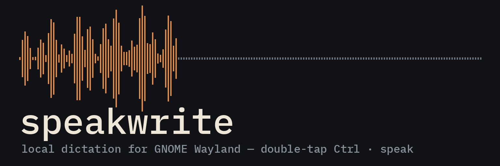
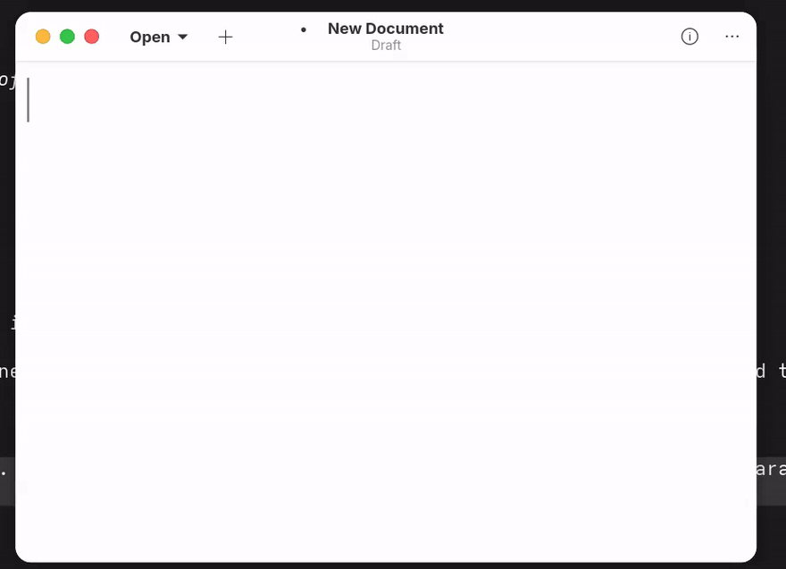

# speakwrite

macOS-style dictation for Fedora/GNOME on Wayland. Double-tap Ctrl, speak, and words type into whatever window has focus — word by word, about half a second behind your voice, 100% local.



Double-tap Ctrl again to stop. Esc cancels. No cloud, no accounts, no audio leaves the machine.

## How it works

```
 double-tap Ctrl
       │
       ▼
 keyd (root, system-level remapper)
   [dtap] oneshot layer → runs a command that writes 1 byte
       │
       ▼
 FIFO ──────────────── the entire root/user privilege boundary
       │
       ▼
 dictate daemon (systemd --user, models loaded once at login)
       │
   ┌───┴────────────────────────────────────────────┐
   │ mic capture                                    │
   │ engine (env-switchable):                       │
   │   nemotron  streaming FastConformer-RNNT,      │
   │             append-only word stream (default)  │
   │   whisper   faster-whisper large-v3 +          │
   │             silero-VAD phrase commits          │
   └───┬────────────────────────────────────────────┘
       │ words (Unicode → ASCII normalized)
       ▼
 ydotool → ydotoold → /dev/uinput → focused window
```

Design notes:

- **Trigger.** keyd already runs as root and already sees every key, so the double-tap detection lives in a keyd `[dtap]` oneshot layer. No extra privileged hotkey listener, no GNOME extension. keyd runs a command that writes one byte into a FIFO; the user daemon reads it. That FIFO is the only thing crossing the root/user boundary.
- **Typing.** Output goes through ydotool/ydotoold to `/dev/uinput`, which works in every app including terminals. keyd is configured to ignore ydotoold's virtual device so the synthesized keystrokes aren't re-remapped.
- **Esc cancel.** The daemon reads keyd's virtual keyboard device via a udev uaccess rule — it watches for Esc while dictation is active, nothing more. No keylogger-grade access, no evdev grab.
- **Engines.**
  - `nemotron` (default): NVIDIA `nemotron-speech-streaming-en-0.6b`, a cache-aware streaming FastConformer-RNNT running under NeMo in its own Python 3.12 venv. Emits an append-only word stream — words are typed as they're recognized and never retracted, which is what makes true word-by-word typing safe. ~1.5 GB VRAM. Accuracy is in the offline Whisper large-v3 class.
  - `whisper`: faster-whisper large-v3 fp16 (~46x realtime on an RTX 5090). silero-VAD detects pauses; each phrase is transcribed and typed at the pause. A `no_speech_prob` filter drops hallucinated segments.
- **GPU optional.** Both engines run on CPU: nemotron 0.6B is faster than realtime on CPU, and the whisper engine falls back to `small` int8.

## Install

Fedora-first. Tested on stock Fedora Workstation (GNOME, Wayland).

```
git clone https://github.com/NelsonScott/speakwrite
cd speakwrite
./install.sh
```

`install.sh` is idempotent and touches exactly:

- a keyd config snippet (the `[dtap]` layer) — merged into `/etc/keyd/`, keyd reloaded
- udev rules: uaccess on keyd's virtual keyboard (Esc cancel) and uinput access for ydotool
- systemd user units: `dictate.service` and `ydotoold.service`
- two Python venvs under the install prefix (NeMo needs its own 3.12 venv; whisper gets the other)
- model downloads on first run (cached locally)

Log out and back in once so the udev rules and user services pick up cleanly.

## Configuration

Environment variables, set via `systemctl --user edit dictate.service` or a drop-in:

| Variable | Default | Meaning |
|---|---|---|
| `DICTATE_ENGINE` | `nemotron` | `nemotron` (streaming, word-by-word) or `whisper` (phrase-at-a-pause) |
| `DICTATE_MODEL` | per engine | Override the model (e.g. `large-v3`, `small`) |
| `DICTATE_LANG` | `en` | Language hint (whisper engine; nemotron model is English-only) |
| `DICTATE_PAUSE_MS` | engine default | Silence length that commits a phrase (whisper engine) |
| `DICTATE_KEY_DELAY` | engine default | Per-keystroke delay passed to ydotool, ms |
| `DICTATE_NO_TYPE` | unset | Transcribe but don't type (debugging) |
| `NEMOTRON_STEP_MS` | model default | Streaming chunk step; smaller = lower latency, more GPU |
| `NEMOTRON_RIGHT_CONTEXT` | model default | Right-context frames; larger = better accuracy, more lag |

## Why not X

**Why keyd and not a GNOME extension?** GNOME extensions can bind hotkeys, but a double-tap-modifier gesture needs raw key timing, and Shell extensions break on every GNOME release. keyd is a small, stable system daemon that already exists for exactly this kind of remapping, and many people (me included) already run it. If you don't, the snippet is ~10 lines.

**Why ydotool and not wtype?** wtype uses the Wayland `virtual-keyboard-unstable-v1` protocol — which Mutter never implemented. Every wtype-based dictation tool is silently broken on GNOME Wayland. ydotool writes to `/dev/uinput`, below the compositor, so it works on GNOME, KDE, X11, and in terminals.

**Why double-tap and not push-to-talk?** Push-to-talk means holding a key while you talk, which fights with typing and mousing. Double-tap Ctrl is the macOS convention, is fast, and never collides with a real shortcut (a lone Ctrl tap does nothing anyway). Start and stop are the same gesture.

**NVIDIA-only?** GPU acceleration currently targets CUDA, yes. But both engines run on CPU — nemotron 0.6B streams faster than realtime on a desktop CPU, and the whisper engine drops to `small` int8. Usable, just less headroom.

## Known limits

- **US-QWERTY assumption.** Typing goes through uinput keycodes; non-US layouts will get wrong characters for some symbols. Unicode input is normalized to ASCII first.
- **Typing follows focus.** Words go to whatever window is focused *at that moment*. Switch windows mid-sentence and the rest of the sentence follows you.
- **Esc is observed, not consumed.** The focused app also receives the Esc that cancels dictation (e.g. it may close a dialog).
- English is the only well-tested language; the nemotron model is English-only.

## Uninstall

```
./install.sh --uninstall
```

Removes the keyd snippet, udev rules, and user units, and reloads keyd. Venvs and cached models live under the install prefix; delete that directory to reclaim the space.

## License

MIT. © Scott Nelson ([github.com/NelsonScott](https://github.com/NelsonScott))
